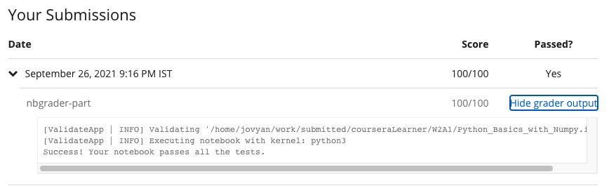

# Practice Programming Assignment: Python Basics with Numpy

## Instructions

    
Welcome to the first (Optional) programming exercise of Course 1 of the Deep Learning Specialization. In this
        notebook you will <em>(insert notebook description here).</em>This notebook will give you a brief
        introduction to Python. Even if you've used Python before, these exercises will help familiarize you with
        some essential functions. 

    

    

    
- Avoid using for-loops and while-loops, unless you are explicitly told to do so.

    
This assignment prepares you well for the upcoming assignment. Take your time to complete it and make sure
        you get the expected outputs when working through the different exercises.&nbsp;

    
After you are done, submit your work and check your results. Click on "My Submission" above. It might take up
        to one minute for the graders to process your submission. You will then see the point breakdown of your
        assignment, along with the grader feedback.

## My Submission Results

#### © Copyright [DeepLearning.AI](https://www.coursera.org/learn/applied-data-science-capstone?specialization=ibm-data-science)