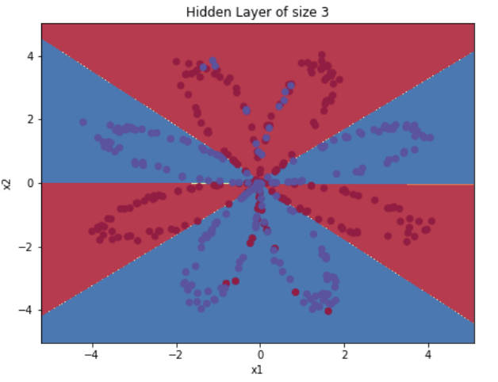
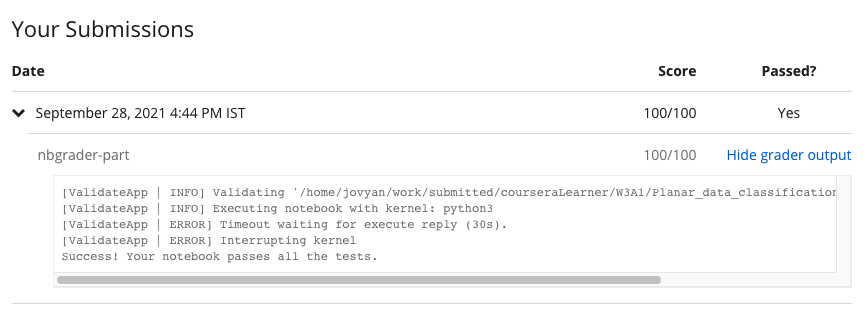

# Programming Assignment: Planar Data Classification with One Hidden Layer

## Instructions

    
<strong>UPDATE:</strong>

    
This <em>assignment</em> was last updated on 25 May 2021, 4:30 AM PST (San Francisco Time).&nbsp;

    
<strong>Change Log:</strong>

    <ul>
        <li>
            
R​evision of unit tests for <em>Exercise 3, Exercise 5</em> and <em>Exercise 6</em>.

        </li>
        <li>
            
R​evised public<em>_tests.py</em> .

        </li>
    </ul>
    

        If you are opening the assignment after this date and time for the first time:

    <ul>
        <li>
            
If you had previously worked on the assignment, you'll now have the latest version with the name
                <em>Planar_data_classification_with_one_hidden_layer.ipynb </em>and the version you were working on
                named with date and time of the update appended at the end,
                <em>Planar_data_classification_with_one_hidden_layer_date_time.ipynb.</em>

        </li>
        <li>
            
If you didn't work on the assignment before then you'll see only one assignment version, which will be
                the latest, with the name, <em>Planar_data_classification_with_one_hidden_layer.ipynb.</em>

        </li>
        <li>
            
You'll have the updated version of <em>public_tests.py</em>.<em> </em>

        </li>
    </ul>
    
<strong>Note:</strong> If you don't notice the above mentioned changes in your assignment, try refreshing your workspace.

    

    
Thank you.

    
------------------------------------

    
Welcome to the second required programming assignment of Course 1 of the Deep Learning Specialization! It's time
        to build your first neural network, which will have one hidden layer. You'll notice a big difference between
        this model and the one you implemented previously using logistic regression. 

        
    
Instructions:

    
- Do not use loops (for/while) in your code, unless the instructions explicitly ask you to do so.

    
- Some code blocks contain graded functions, where you’ll be expected to write some code. These are marked at the
        top of the block by a #GRADED FUNCTION comment, and you’ll write your code in between the ### START SOLUTION
        HERE ### and ###END SOLUTION HERE### comments. Also, look for another comment that indicates roughly how many
        lines of code it will take to complete. After coding your function, run the cell right below it. This cell
        checks whether your results are correct, and cannot be modified.

    
When you run that cell and see the following:&nbsp;

    
"All tests passed."

    
...You’re in good shape. :)&nbsp;

    
Take your time to complete this assignment! After you are done, submit your work and check your results. You need
        to score 70% to pass. Good luck! :)&nbsp;

    
Click on "My Submission" above to see your grades. It might take up to one minute for the graders to process your
        submission. You will see the point breakdown of your assignment, along with the grader feedback.

## My Submission Results

#### © Copyright [DeepLearning.AI](https://www.coursera.org/learn/applied-data-science-capstone?specialization=ibm-data-science)