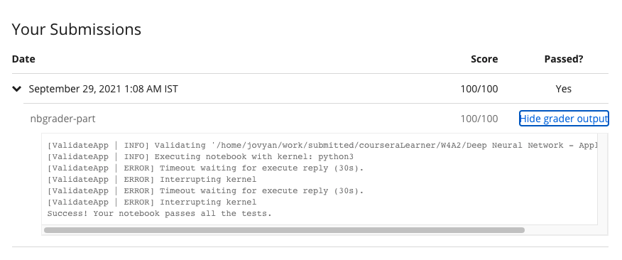

# Programming Assignment: Deep Neural Network - Application

## Instructions

    

        
<strong>UPDATE:</strong>

        
The <em>public_tests.py </em>file for this <em>assignment</em> was last updated on 1 July 2021, 8:50 AM PST
            (San Francisco Time).&nbsp;

        
<strong>Change Log:</strong>

        <ul>
            <li>
                
Revised <em>unit tests</em> for <em>Exercise 1</em> and <em>Exercise 2</em>.
                

            </li>
        </ul>
        
If you are opening the assignment for the first time after this date and time:

        <ul>
            <li>
                
You'll already have the updated<em> public_tests.py </em>file<em>.</em>
                

            </li>
        </ul>
        
<strong>Note:</strong> If you don't notice the above mentioned changes in your assignment, try <a
                href="https://www.coursera.org/learn/neural-networks-deep-learning/supplement/iLwon/h-ow-to-refresh-your-workspace"
                title="" target="_blank" rel="noopener nofollow" aria-label="">refreshing your workspace</a>.

        

            Thank you.

        
------------------------------------

        

        
Welcome to the second (required) programming exercise of Course 1, Week 4 of the Deep Learning Specialization
            - the final assignment in this course! In this notebook you will build and train a deep L-layer neural
            network, and apply it to the very important problem of classifying cat images from non-cat images. :) 

        
        
Instructions:

        
- Do not use loops (for/while) in your code, unless the instructions explicitly ask you to do so.

        
- Some code blocks contain graded functions, where you’ll be expected to write some code. These are marked at
            the top of the block by a #GRADED FUNCTION comment, and you’ll write your code in between the ### START
            SOLUTION HERE ### and ###END SOLUTION HERE### comments. Also, look for another comment that indicates
            roughly how many lines of code it will take to complete. After coding your function, run the cell right
            below it. This cell checks whether your results are correct, and cannot be modified.

        
When you run that cell and see the following:&nbsp;

        
"All tests passed."

        
...You’re in good shape. :)&nbsp;

        
Take your time to complete this assignment! After you are done, submit your work and check your results. You
            need to score 70% to pass. Good luck! :)&nbsp;

        
Click on "My Submission" above to see your grades. It might take up to one minute for the graders to process
            your submission. You will see the point breakdown of your assignment, along with the grader feedback.

    

## My Submission Results

#### © Copyright [DeepLearning.AI](https://www.coursera.org/learn/applied-data-science-capstone?specialization=ibm-data-science)