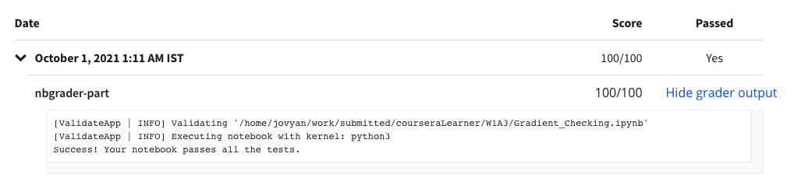

# Programming Assignment: Gradient Checking

## Instructions

    
Welcome to the third (required) assignment of Course 2 of the Deep Learning Specialization! In this assignment,
        you'll implement gradient checking to check for errors in your implementation of a fraud detection model. 

    
    
Instructions:

    
- Avoid using for-loops and while-loops, unless you are explicitly told to do so.

    
- After coding your function, run the cell right below it to check if your result is correct.

    
Take your time to complete this assignment and make sure you get the expected outputs when working through the
        different exercises. These notebooks often use hidden tests to ensure that your results are as expected. When
        you see the following:&nbsp;

    
All tests passed.

    
...You’re in good shape. :)&nbsp;

    
Some code blocks contain graded functions, where you’ll be expected to write some code. These are marked at the
        top of the block by a #GRADED FUNCTION comment, and you’ll write your code in between the ### START SOLUTION
        HERE ### and ###END SOLUTION HERE### comments. Also, look for another comment that indicates roughly how many
        lines of code it will take to complete the graded function.&nbsp;

    
After you are done, submit your work and check your results. You need to score 70% to pass. Good luck! :)&nbsp;
    

    
Click on "My Submission" above to see your grades. It might take up to one minute for the graders to process your
        submission. You will see the point breakdown of your assignment, along with the grader feedback.

## My Submission Results

#### © Copyright [DeepLearning.AI](https://www.coursera.org/learn/applied-data-science-capstone?specialization=ibm-data-science)