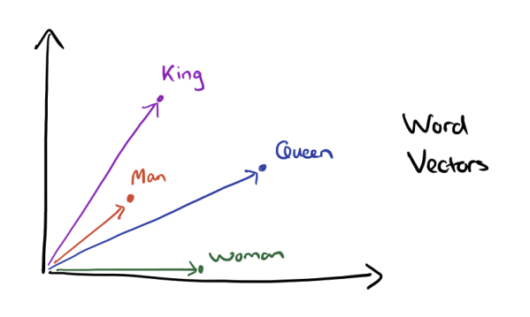
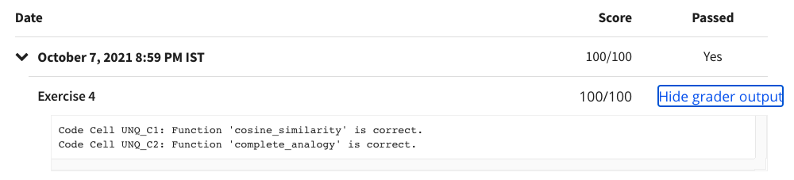

# Programming Assignment: Operations on Word Vectors - Debiasing

## Instructions

    
Welcome to your first assignment of Week 2, Course 5 of the Deep Learning Specialization!

    
Because word embeddings are very computationally expensive to train, most ML practitioners will load a
        pre-trained set of embeddings. In this notebook you'll try your hand at loading, measuring similarity between,
        and modifying pre-trained embeddings.

    
At the end of this notebook you'll have a chance to try an optional exercise, where you'll modify word embeddings
        to reduce their gender bias. Reducing bias is an important consideration in ML and NLP, so you're encouraged to
        take this challenge! 

    
Instructions:

    
- Do not use loops (for/while) in your code, unless the instructions explicitly ask you to do so.

    
- Some code blocks contain graded functions, where you’ll be expected to write some code. These are marked at the
        top of the block by a #GRADED FUNCTION comment, and you’ll write your code in between the ### START SOLUTION
        HERE ### and ###END SOLUTION HERE### comments. Also, look for another comment that indicates roughly how many
        lines of code it will take to complete. After coding your function, run the cell right below it. This cell
        checks whether your results are correct, and cannot be modified.

    
When you run that cell and see the following:&nbsp;

    
"All tests passed."

    
...You’re in good shape. :)&nbsp;

    
Take your time to complete this assignment! After you are done, submit your work and check your results. You need
        to score 70% to pass. Good luck! :)&nbsp;

    
Click on "My Submission" above to see your grades. It might take up to one minute for the graders to process your
        submission. You will see the point breakdown of your assignment, along with the grader feedback.

## My Submission Results

#### © Copyright [DeepLearning.AI](https://www.coursera.org/learn/applied-data-science-capstone?specialization=ibm-data-science)