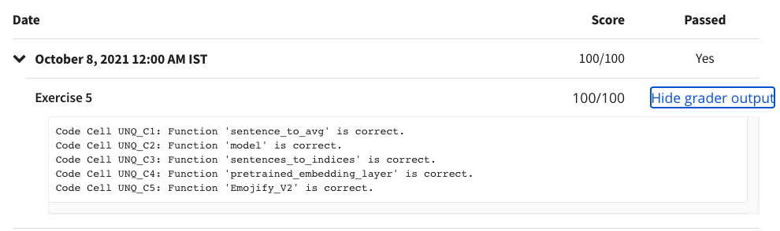

# Programming Assignment: Emojify

## Instructions

    <h2><strong>UPDATE:</strong></h2>
    
This <em>assignment</em> was last updated on 16 August 2021, 5:30 AM PST (San Francisco Time).&nbsp;

    
<strong>Change Log:</strong>

    <ul>
        <li>
            
Revised <em>doc string</em> for <em>Exercise 1</em>.

        </li>
        <li>
            
R​evised <em>equation for "Z"</em> for clarity in <em>Exercise 2</em>.

        </li>
        <li>
            
R​emoved <em>unnecessary code block</em> which was after <em>Exercise 2</em>.

        </li>
    </ul>
    
If you are opening the assignment for the first time after this date and time:

    <ul>
        <li>
            
If you had previously worked on the assignment, you'll now have the latest version with the name
                <em>Emoji_v3a.ipynb </em>and the version you were working on before named with date and time of the
                update appended at the end, <em>Emoji_v3a_date_time.ipynb.</em>

        </li>
        <li>
            
If you didn't work on the assignment before then you'll see only one assignment version, which will be
                the latest, with the name, <em>Emoji_v3a.ipynb.</em>

        </li>
    </ul>
    
------------------------------------

    
Welcome to the second assignment of Week 2, Course 5 of the Deep Learning Specialization! You're going to use
        word vector representations to build two Emojifiers: the first will be a baseline model using pre-trainedword
        embeddings, and the second will be a more sophisticated version using an LSTM! 🤩 💫 🔥

    
You'll implement a model which inputs a sentence (such as "Let's go see the baseball game tonight!") and finds
        the most appropriate emoji to be used with this sentence (⚾️).

    
Instructions:

    
- Do not use loops (for/while) in your code, unless the instructions explicitly ask you to do so.

    
- Some code blocks contain graded functions, where you’ll be expected to write some code. These are marked at the
        top of the block by a #GRADED FUNCTION comment, and you’ll write your code in between the ### START SOLUTION
        HERE ### and ###END SOLUTION HERE### comments. Also, look for another comment that indicates roughly how many
        lines of code it will take to complete. After coding your function, run the cell right below it. This cell
        checks whether your results are correct, and cannot be modified.

    
When you run that cell and see the following:&nbsp;

    
"All tests passed."

    
...You’re in good shape. :)&nbsp;

    
Take your time to complete this assignment! After you are done, submit your work and check your results. You need
        to score 70% to pass. Good luck! :)&nbsp;

    
Click on "My Submission" above to see your grades. It might take up to one minute for the graders to process your
        submission. You will see the point breakdown of your assignment, along with the grader feedback.

## My Submission Results

#### © Copyright [DeepLearning.AI](https://www.coursera.org/learn/applied-data-science-capstone?specialization=ibm-data-science)