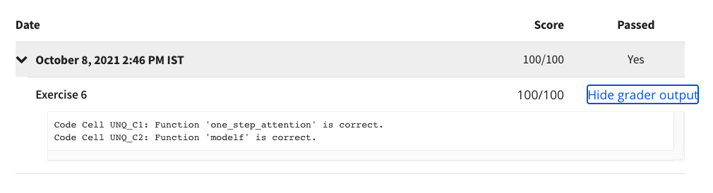

# Programming Assignment: Neural Machine Translation

## Instructions

    
Welcome to your first programming assignment for this week!

    <ul>
        <li>
            
You will build a Neural Machine Translation (NMT) model to translate human-readable dates ("25th of June,
                2009") into machine-readable dates ("2009-06-25").

        </li>
        <li>
            
You will do this using an attention model, one of the most sophisticated sequence-to-sequence models.

        </li>
    </ul>
    
This notebook was produced together with NVIDIA's Deep Learning Institute.

## My Submission Results

#### © Copyright [DeepLearning.AI](https://www.coursera.org/learn/applied-data-science-capstone?specialization=ibm-data-science)