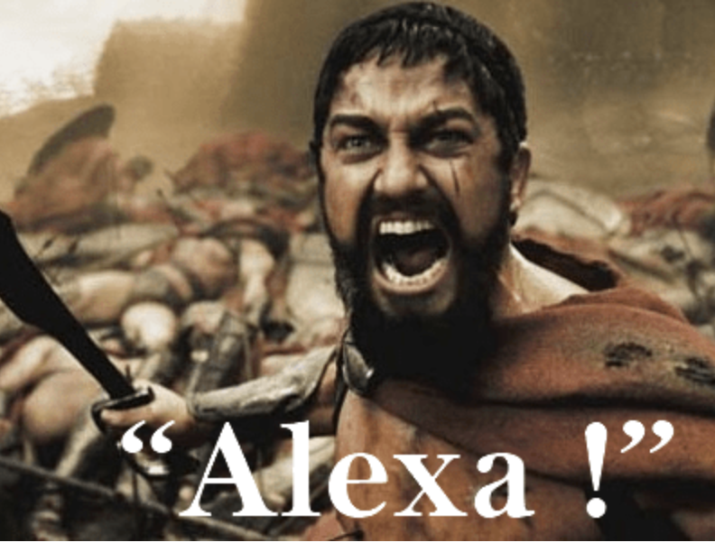
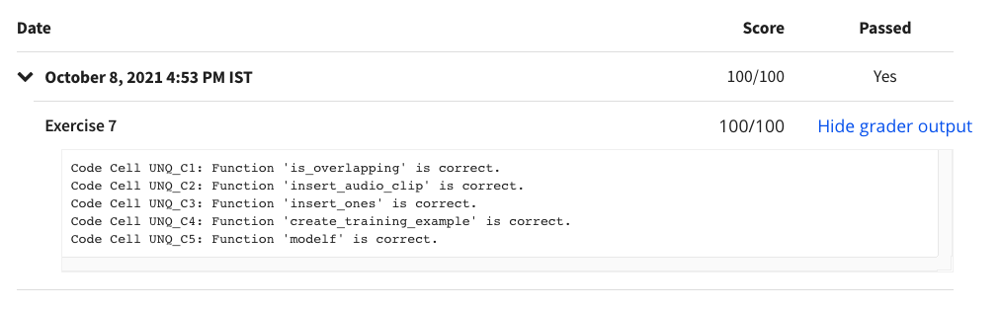

# Programming Assignment: Trigger Word Detection

## Instructions

    
Welcome to the second (required) programming assignment in Course 5 of the Deep Learning Specialization!

    
In this assignment, you'll construct a speech dataset from synthesized data and implement an algorithm for
        trigger word detection (sometimes also called keyword detection, or wake word detection). Trigger word detection
        is the technology that allows devices like Amazon's Alexa or Apple's Siri to wake up upon hearing a certain
        word. At the end of this assignment, you'll be able to record a clip of yourself talking, and have the algorithm
        trigger a chime when it detects you saying "activate." 

    
Instructions:

    
- Do not use loops (for/while) in your code, unless the instructions explicitly ask you to do so.

    
- Some code blocks contain graded functions, where you’ll be expected to write some code. These are marked at the
        top of the block by a #GRADED FUNCTION comment, and you’ll write your code in between the ### START SOLUTION
        HERE ### and ###END SOLUTION HERE### comments. Also, look for another comment that indicates roughly how many
        lines of code it will take to complete. After coding your function, run the cell right below it. This cell
        checks whether your results are correct, and cannot be modified.

    
When you run that cell and see the following:&nbsp;

    
"All tests passed."

    
...You’re in good shape. :)&nbsp;

    
Take your time to complete this assignment! After you are done, submit your work and check your results. You need
        to score 70% to pass. Good luck! :)&nbsp;

    
Click on "My Submission" above to see your grades. It might take up to one minute for the graders to process your
        submission. You will see the point breakdown of your assignment, along with the grader feedback.

## My Submission Results

#### © Copyright [DeepLearning.AI](https://www.coursera.org/learn/applied-data-science-capstone?specialization=ibm-data-science)