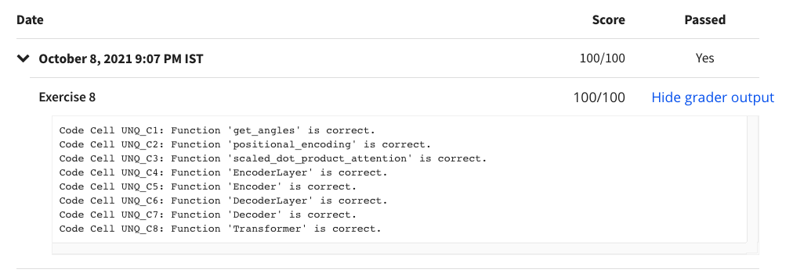

# Programming Assignment: Transformers Architecture with TensorFlow

## Instructions

    <h2><strong>UPDATE:</strong></h2>
    
The <em>assignment</em> was last updated on 29 September 2021, 12:50 PM PST (San Francisco Time).&nbsp;

    
<strong>Change Log:</strong>

    <ul>
        <li>
            
Revised <em>code block comments</em> for <em>Exercise 5</em>.

        </li>
    </ul>
    
If you are opening the assignment for the first time after this date and time:

    <ul>
        <li>
            
If you had previously worked on the assignment, you'll now have the latest version with the name
                <em>C5_W4_A1_Transformer_Subclass_v1.ipynb </em>and the version you were working on named with date and
                time of the update appended at the end, <em>C5_W4_A1_Transformer_Subclass_v1_date_time.ipynb.</em>
            

        </li>
        <li>
            
If you didn't work on the assignment before then you'll see only one assignment version, which will be
                the latest, with the name, <em>C5_W4_A1_Transformer_Subclass_v1.ipynb.</em>

        </li>
    </ul>
    

        <strong>Note:</strong> If you don't notice the above mentioned changes in your assignment, try refreshing your
        workspace.
    

    
Thank you.

    
------------------------------------

    
In this assignment you will implement the components of the transformers model in TensorFlow 2.4. Provide an
        assignment summary and general instructions. If your assignment uses starter files, include the starter file
        link provided by Coursera.

## My Submission Results

#### © Copyright [DeepLearning.AI](https://www.coursera.org/learn/applied-data-science-capstone?specialization=ibm-data-science)