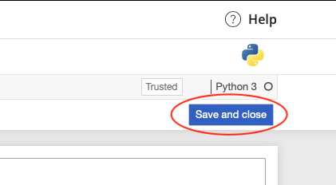

# Programming Assignment: Transformer Network Application: Named-Entity Recognition

## Instructions

    <h2><u>I​MPORTANT</u></h2>
    
H​ey learner,

    
I​n this ungraded lab, on the top right you'll see a button, "Save and close". Please press it every time when
        you are no longer running or closing the lab. This helps to release the GPU resources used by your version of
        the lab, so that other learners can benefit from it as much as you did.

    

    

    

    
T​hank you and happy learning!

    
-​--------------------------------------------------

    
I​n this ungraded lab, you will optimize a Transformer model to perform Named-Entity Recognition (NER) on a
        dataset of resumes. You will use tokenizers and pre-trained models from the HuggingFace Library.

#### © Copyright [DeepLearning.AI](https://www.coursera.org/learn/applied-data-science-capstone?specialization=ibm-data-science)